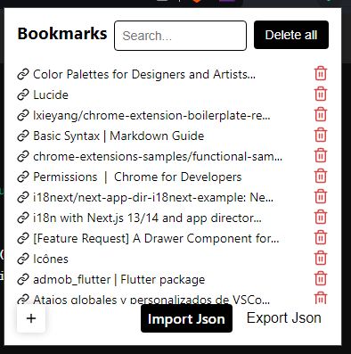

# Eden Bookmarks for developers. organize your websites

## Features

A extension to manage bookmarks for productivity of the developer using [Chrome Extension (MV3) Boilerplate with React 18 and Webpack 5](https://github.com/lxieyang/chrome-extension-boilerplate-react)

- Add url from active tab
- Export to JSON
- Import from JSON

## Installing and Running

### Procedures:

1. Check if your [Node.js](https://nodejs.org/) version is >= **18**.
2. Clone this repository.
3. Change the package's `name`, `description`, and `repository` fields in `package.json`.
4. Change the name of your extension on `src/manifest.json`.
5. Run `npm install` to install the dependencies.
6. Run `npm start`
7. Load your extension on Chrome following:
   1. Access `chrome://extensions/`
   2. Check `Developer mode`
   3. Click on `Load unpacked extension`
   4. Select the `build` folder.
8. Happy hacking.

## Structure

All your extension's code must be placed in the `src` folder.

The boilerplate is already prepared to have a popup, an options page, a background page, and a new tab page (which replaces the new tab page of your browser). But feel free to customize these.
